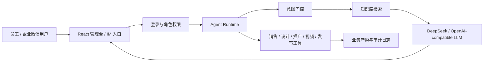

# 家装 AI 转型平台全栈骨架

这是一个面向家装定制行业的 AI 转型项目骨架，目标不是做一个单点聊天机器人，而是把企业内部常见的 AI 落地链路串起来：角色权限、知识库、RAG、真实 LLM 调用、Agent 工具编排、业务产物沉淀、企业微信入口和云服务器部署。

## 核心流程



## 目录结构

```text
D:\project
├─ backend/                 FastAPI 后端
│  ├─ app/api/              登录、管理台、知识库、聊天、Agent、企微 API
│  ├─ app/core/             配置、安全、网络与运行时保护
│  ├─ app/db/               SQLAlchemy 会话
│  ├─ app/models/           PostgreSQL ORM 表模型
│  └─ app/services/         RAG、LLM、Agent、业务工具、发布与视频服务
├─ frontend/                React + Vite + TypeScript 管理台
├─ integrations/            企业微信长连接 sidecar
├─ docs/                    项目说明、部署文档与视觉资产
├─ scripts/                 本地启动、迁移、部署检查、密钥扫描
├─ .github/workflows/       CI/CD 工作流
├─ docker-compose.yml       本地全栈演示
└─ docker-compose.prod.yml  云服务器生产编排
```

## 启动命令

```powershell
npm run start:dev
```

手动启动：

```powershell
docker compose up -d postgres
python -m venv .venv
.\.venv\Scripts\pip install -r backend\requirements.txt
.\.venv\Scripts\python -m alembic upgrade head
.\.venv\Scripts\uvicorn backend.app.main:app --reload --host 0.0.0.0 --port 8000
npm --prefix frontend install
npm --prefix frontend run dev
```

## 数据库表设计

核心表包括：

- `roles`、`users`：用户、角色和登录权限
- `knowledge_bases`、`knowledge_permissions`：知识库和角色访问控制
- `knowledge_documents`、`knowledge_chunks`：上传文档、切片和检索元数据
- `conversations`、`conversation_messages`：聊天会话和消息持久化
- `rag_query_logs`：RAG gate、召回、rerank、triad 和命中状态观测
- `agents`、`agent_runs`、`agent_steps`、`agent_tool_calls`：Agent Runtime 状态和工具调用审计
- `business_artifacts`：销售初筛、设计需求卡、推广文案、视频生成等业务产物
- `publish_jobs`：多平台发布任务
- `wecom_webhook_events`：企业微信事件与回复日志

完整 SQL 见 [schema.sql](schema.sql)。

## 知识库权限分级

| 知识库 | 可访问角色 | 主要内容 |
| --- | --- | --- |
| 销售库 | 销售团队、销售总监 | 产品工艺、报价、话术、FAQ、竞品分析 |
| 设计库 | 设计师、设计经理 | 案例图库、工艺标准、材质规格 |
| 推广库 | 推广团队、推广经理 | 品牌规范、竞品分析、爆款文案模板 |
| 管理库 | 管理层 | 经营数据、人员绩效、战略资料 |
| 公共库 | 全体员工 | 公司介绍、规章制度、通用培训资料 |

## RAG 判定

平台采用三层判定，避免“闲聊也召回高分”的问题：

1. 意图分类：先判断是否属于家装业务、公司制度、平台使用或知识库问题。
2. Reranker 分数：再判断召回内容是否真的相关，融合向量、BM25、rerank 和业务强词信号。
3. RAG Triad：回答后判断资料相关性、回答切题性和 groundedness。

最终返回：

- `✅ 已命中知识库`
- `⚠ 可能相关，建议人工确认`
- `❌ 知识库未命中`

人工抽检用例见 [rag-eval-cases.md](rag-eval-cases.md)。

## 企业微信与 Agent

企业微信 webhook 和长连接 sidecar 会把消息送入统一 Agent Runtime。Agent 会先做意图判断，再路由到聊天、知识库问答、销售工具、设计工具、推广工具、视频生成或发布任务。所有关键步骤都会写入运行记录，便于排查和演示。

## 生产化提醒

- 生产环境必须配置强 `JWT_SECRET_KEY` 和所有种子账号密码。
- DeepSeek、企业微信、MultiPost、MoneyPrinterTurbo 等第三方能力都通过环境变量配置。
- `.env`、数据库文件、模型缓存、上传文件和日志目录不应提交。
- 上云前执行：

```powershell
npm run check:deploy
```
